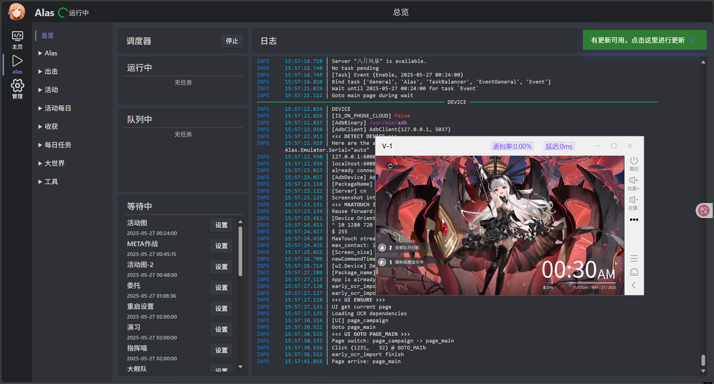

**最近朋友的服务器出了点小问题，没有办法连接到Docker容器进行快乐搬砖，于是决定挖肉掏出来一点钱买个云手机过度一下**

# 准备材料：

* 一台云手机（暂时选择章鱼云凑合，价格还算便宜）
* 一台具有公网的Linux服务器，我选择的是 `Oracle Ubuntu x86_64 GNU/Linux`
* 脑子和手

# 测试adb联通性：

* 通过章鱼云提供的adb shell反代进入shell模式


此时会在你本地启动一个反代隧道，你可以使用 `adb devices`进行查看

示例输出：

```shell
kawakaze@lilac-arm：~# adb devices
List of devices attached
127.0.0.1:20000 device
```

测试成功之后，我们就可以开始部署穿透服务了

# 部署穿透服务：

**我采用的是开源的frpc方案，此方案不具备通用性，故请大家做好其他准备**

## 公网服务器部署：

1.克隆仓库：

```shell
#在公网服务器运行 AMD64架构
wget https://github.com/fatedier/frp/releases/download/v0.58.0/frp_0.58.0_linux_amd64.tar.gz
tar -xvzf frp_0.58.0_linux_amd64.tar.gz
cd frp_0.58.0_linux_amd64
```

2.配置文件 `frps.ini`

```ini
[common]
bind_port = 7000
dashboard_port = 7500
dashboard_user = admin
dashboard_pwd = admin
```

3.启动frp：

```
./frps -c frps.ini

```

观察运行输出判断即可

日志示例:

```plaintext
2025-05-26 15:33:31.139 [I] [sub/root.go:142] start frpc service for config file [frps.ini]
2025-05-26 15:33:31.140 [I] [client/service.go:294] try to connect to server...
2025-05-26 15:33:31.140 [W] [client/service.go:297] connect to server error: dial tcp 0.0.0.0:7000: connect: connection refused
2025-05-26 15:33:31.140 [I] [sub/root.go:160] frpc service for config file [frps.ini] stopped
2025-05-26 15:34:10.322 [I] [frps/root.go:105] frps uses config file: frps.ini
2025-05-26 15:34:10.639 [I] [server/service.go:237] frps tcp listen on 0.0.0.0:7997
2025-05-26 15:34:10.639 [I] [frps/root.go:114] frps started successfully
2025-05-26 15:34:10.639 [I] [server/service.go:351] dashboard listen on 0.0.0.0:7500
2025-05-26 15:34:17.635 [I] [server/service.go:576] [dxxx09] client login info: ip [1.1.1.1:44136] version [0.58.0] hostname [] os [linux] arch [arm64]
2025-05-26 15:34:17.706 [I] [proxy/tcp.go:82] [dxxx09] [web] tcp proxy listen port [6000]
2025-05-26 15:34:17.706 [I] [server/control.go:399] [dxxx9] new proxy [web] type [tcp] success
2025-05-26 15:35:19.326 [I] [proxy/proxy.go:204] [dxxxa09] [web] get a user connection [127.0.0.1:40600]
2025-05-26 15:47:29.818 [I] [proxy/proxy.go:204] [d0xxx08a09] [web] get a user connection [127.0.0.1:50372]
```

## 云手机部署：

**由于章鱼云手机对于Termux的围追堵截，我已经不想再去找他的空子，也不知道他们的脑子是不是参了冰，总之我们直接使用adb shell部署**

1.克隆仓库

```shell
wget https://github.com/fatedier/frp/releases/download/v0.58.0/frp_0.58.0_linux_arm64.tar.gz
tar -xvzf frp_0.58.0_linux_arm64.tar.gz
cd frp_0.58.0_linux_arm64
```

2.编辑 `frpc.ini`

```ini
[common]
server_addr = $你的公网服务器IP
server_port = $你对外开放的端口

#这表示将安卓本地的 5555 端口暴露到远程服务器的 6000 端口
[ssh]
type = tcp
local_ip = 127.0.0.1
local_port = 5555
remote_port = 6000

```

3.运行测试：

```shell
./frpc -c frpc.ini
```

日志示例：

```plaintext
WARNING: ini format is deprecated and the support will be removed in the future, please use yaml/json/toml format instead!
2025-05-26 15:34:17.445 [I] [sub/root.go:142] start frpc service for config file [frpc.ini]
2025-05-26 15:34:17.446 [I] [client/service.go:294] try to connect to server...
2025-05-26 15:34:17.672 [I] [client/service.go:286] [dxxx9] login to server success, get run id [dxxx9]
2025-05-26 15:34:17.673 [I] [proxy/proxy_manager.go:173] [dxxx9] proxy added: [web]
2025-05-26 15:34:17.741 [I] [client/control.go:168] [dxxx9] [web] start proxy success
```

一切就绪之后，你应该就可以在远端公网服务器连接到你的云手机了
使用 `adb connect $localhost:对外开放的端口` 即可

~~傻白可爱捏~~

Alas部署参考：[Alas官方仓库](https://github.com/LmeSzinc/AzurLaneAutoScript/wiki/Installation_cn)

---

成功示例：


